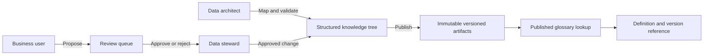

# Supply Chain Ontology, Process & Evidence (SCOPE)

> Shared meaning. Traceable evidence. Approved knowledge.

[](https://dotnet.microsoft.com/)


SCOPE organizes domain knowledge into an inspectable, tree-backed product. Business meaning, source mappings, calculation rules, evidence, freshness, ownership, and approvals live together instead of being fragmented across prompts, reports, code, documents, and individual experts.

This folder contains an independent, synthetic-data demonstration created for Microsoft Hackathon 2026.
It is not a production application or a connection to an employer's systems.

## The Problem

Enterprise agents can produce fluent answers while relying on ambiguous terminology, stale data, unapproved calculations, business perceptions, or undocumented source mappings.

Business owners often cannot inspect what an agent knows, understand how it calculates an answer, or safely approve a change. This creates a trust and adoption gap between an AI prototype and an enterprise decision tool.

## The Solution

SCOPE provides reusable catalogs for:

| Knowledge area | What SCOPE governs |
| --- | --- |
| Ontology | Business objects, concepts, glossary terms, aliases, and relationships |
| Process | How demand, supply, buffers, and execution connect |
| Evidence | Source mappings, approved reports, grounding values, and provenance |
| Semantics | Measures, aggregations, filters, and calculation rules |
| Operations | Dataset freshness, status, ownership, and answerability |
| Governance | Proposals, duplicate checks, steward review, approval, and publication |

In the local demonstration, proposals stay outside the approved authoring tree until a steward approves them.
Approval updates that tree; explicit publication creates a numbered glossary and typed-record snapshot.
The published-answer endpoint reads the published glossary, not pending proposals. Approval is a workflow
status, not proof of data quality. This application does not run live numeric queries or an LLM.

## Personas

- **Business users** browse approved knowledge, inspect traceability, and propose changes.
- **Data stewards** compare proposed and current content, review duplicate warnings, approve or reject changes, and publish versions.
- **Data architects** maintain source mappings, fields, and technical validation while preserving business ownership.

## What Makes It Different

Most AI solutions treat domain knowledge as prompt content or retrieved documents. SCOPE treats knowledge as an operated product with typed structure, ownership, lifecycle, validation, and a release boundary.

The model is reusable across domains: the application discovers a domain from its knowledge tree, so another supply-chain or business area can adopt the same catalogs and governance workflow without changing application code.

## Architecture



## Demo Flow

1. **Explore:** browse the fictional process map, objects, definitions, measures, metrics, and supported values.
2. **Explain:** open the synthetic Planned Demand or Supply Coverage context and its documented source mapping.
3. **Govern locally:** in local interactive mode, propose a glossary correction as Business user, then review it as Data steward.
4. **Publish:** confirm that proposal and approval leave the previously published answer unchanged, explicitly publish,
   then read the updated definition and version. Old snapshots remain available on disk.

The hosted default is read-only: visitors can inspect the demo, but cannot alter shared content.

## Capability Status

These statuses describe only this public repository. Proposed extensions are design ideas, not
runnable features, delivery commitments, or claims about another implementation.

| Capability | Status | Boundary |
| --- | --- | --- |
| Catalog browsing, search and metric context | Available | Uses fictional knowledge; metric context is read-only. |
| Proposals, steward review and numbered publication | Available locally | Requires local interactive mode; the hosted default is read-only. |
| Published definition lookup and version reference | Available | Reads the published glossary; not a conversational or numerical agent. |
| Freshness metadata and worked metric calculations | Illustrative only | Fixed sample metadata and documented expected results, not live verification or runtime calculations. |
| Evidence verification, release activation and rollback | Proposed extension | Treat approval, verification and selection of the serving release as separate decisions. |
| Source qualification | Proposed extension | Qualify individual definitions and their dependencies, not an entire report by association. |
| Answerability and safe refusal | Proposed extension | Distinguish answerable questions, missing scope and insufficient evidence before execution. |
| Context-aware follow-ups | Proposed extension | Make inherited scope visible; clarify ambiguous changes instead of guessing. |
| Evidence-rich answer presentation | Proposed extension | Keep scope, version, supporting evidence and limitations beside an answer. |

The public application has no numerical execution engine, LLM, live source connector or production
authentication. The examples below do not add those capabilities.

## Fictional Extension Scenarios

These independently authored toy scenarios illustrate the proposed extensions only. They are not
application outputs, measured results, or representations of any organization's processes or data.

1. **Separate governance decisions.** A fictional steward approves a revised definition of
   "available stock." That approval does not verify source accuracy or change the serving release.
   A future demo would separately record evidence verification, activate a selected release and
   demonstrate rollback. Editing the definition would require its verification to be reconsidered.
2. **Qualify source content.** An invented report contains "units requested" and "units packed."
   The first definition has complete supporting references; the second has an unresolved dependency.
   A future qualification view would show both states and their reasons rather than treating every
   definition in the report as ready to use.
3. **Explain answerability.** A proposed demo would distinguish "What does units requested mean?"
   from "How many were requested?" The latter needs a period and product selection. If the chosen
   scope has no usable evidence, the response would state that limitation instead of inventing a
   quantity. The current public demo does not execute these numerical questions.
4. **Make follow-up scope explicit.** In a fictional conversation about Product A during Period 1,
   "What about Period 2?" would retain Product A and display the changed period. An ambiguous
   follow-up such as "Compare the other one" would request clarification.
5. **Show the answer's boundaries.** A proposed answer card could contain the following invented
   fields. Its number is a manually authored illustration, not an application calculation:

   | Field | Fictional illustration |
   | --- | --- |
   | Answer | 12 units requested |
   | Scope | Product A, Period 1, sample snapshot |
   | Knowledge version | Sample release 1 |
   | Evidence | Invented order list, rows 1-3 |
   | Limitation | Does not establish availability or delivery timing |

Before labelling any extension available, implement it using independent synthetic fixtures,
demonstrate both success and limitation cases, and update the status table to match what visitors
can actually run. No accuracy, business-impact or production-readiness result is implied.

## Run Locally

### Prerequisite

- [.NET 10 SDK](https://dotnet.microsoft.com/download/dotnet/10.0)

### Start SCOPE

Clone the public repository and start the read-only demo:

```powershell
git clone https://github.com/poorna-kant/projects.git
Set-Location projects
dotnet restore hackathon\kb-app\KbApp.csproj --configfile hackathon\NuGet.Config
Set-Location hackathon\kb-app
dotnet run --no-restore --urls http://127.0.0.1:8080
```

Open <http://127.0.0.1:8080>. Startup copies the synthetic seed into an isolated local state directory.
All runtime changes are kept out of the checked-in seed files.

To try interactive authoring on your own machine:

```powershell
$env:SCOPE_READ_ONLY = "false"
dotnet run --no-restore --urls http://127.0.0.1:8080
```

Write requests also require a loopback client, a loopback Host, a same-origin Origin when present,
and `X-SCOPE-Local: 1` (the UI sends it). Do not expose this local mode through tunnels or reverse
proxies. Persona switching is not authentication. Set `SCOPE_READ_ONLY=true` for any hosted demo.

NuGet uses Microsoft's public `dotnet-public` feed through the folder-scoped `NuGet.Config`, not
NuGet.org. This feed does not advertise vulnerability-audit data; a successful restore is not a
clean vulnerability audit. Review advisories separately before broader deployment.

### Container deployment

From the repository root:

```powershell
docker build -t scope-demo -f hackathon\Dockerfile hackathon
docker compose -f hackathon\compose.yaml up --build -d
```

The supplied Compose file exposes the read-only demo on `127.0.0.1:8080`. To host it, use the same
image with a managed HTTPS ingress targeting container port 8080 and `/healthz` as the health probe.
Keep `SCOPE_READ_ONLY=true`. Run **one replica** and attach a writable persistent volume at `/app/state`
with permissions for the image's non-root `app` user. Do not publish this state directory as static content.
No cloud resources, credentials, or live source connectors are required or provisioned by this repository.

SQLite, the approved authoring tree, proposals and snapshots live in that volume. Ephemeral storage loses
changes at replacement; sharing one state directory among multiple replicas is unsupported and startup
uses an exclusive instance lock. Back up the stopped instance's state directory when needed.
To reset the fictional data, stop the demo and deliberately remove its state directory or named volume;
this permanently deletes local proposals and snapshots.

| Setting | Default | Purpose |
| --- | --- | --- |
| `SCOPE_READ_ONLY` | `true` | Deny all write requests unless explicitly enabled for local use. |
| `SCOPE_STATE_PATH` | `kb-app/data/scope` locally; `/app/state` in the image | Mutable SQLite, authoring records, reviews and snapshots. |
| `SCOPE_SEED_PATH` | Sibling `knowledge-base` locally; `/app/seed/knowledge-base` in the image | Synthetic seed, copied only when a state tree does not exist. |
| `ASPNETCORE_HTTP_PORTS` | `8080` in the image | Container listening port. |

### Contributor validation

From the repository root, with PowerShell 7:

```powershell
dotnet restore hackathon\kb-app\KbApp.csproj --configfile hackathon\NuGet.Config
dotnet build hackathon\kb-app\KbApp.csproj -c Release --no-restore
pwsh -File hackathon\scripts\check-public-content.ps1
pwsh -File hackathon\scripts\smoke.ps1
```

The smoke runner uses an isolated temporary state directory and an ephemeral loopback port; it checks
read-only enforcement, local proposal/approval/publication, metric generation and persistence, then
stops its processes and removes its temporary data. The GitHub workflow runs these checks and builds
the container. It does not deploy or publish artifacts.

## Repository Layout

```text
hackathon/
|-- kb-app/                 .NET API and browser application
|   |-- Program.cs          API routes and application composition
|   |-- Store.cs            Glossary authoring and publication
|   |-- Registry.cs         Governed measures and source registry
|   |-- TreeReader.cs       Structured catalog reader
|   |-- TreeStore.cs        Validated knowledge authoring
|   |-- ReviewStore.cs      Proposal and steward review workflow
|   |-- KbEval.cs           Duplicate evaluation
|   `-- wwwroot/            User interface
`-- knowledge-base/         Synthetic domain tree
	|-- _schema/            Public metric-context authoring guide
	|-- _eval/              Illustrative lookup scenarios
	`-- plan/               Demo supply-chain domain
```

## Technology

- .NET 10 minimal API
- SQLite authoring and review store
- YAML, JSON, and Markdown knowledge records
- HTML, CSS, and JavaScript browser interface
- Local-first, configuration-driven file paths

## Metric-context contributor starting point

Use a feature branch in this repository, for example `feature/demo-metric-context`.
The public examples are `planning.demand` (Planned Demand, `DEMO-001`) and
`planning.coverage` (Supply Coverage, `DEMO-002`). They are fictional, not official metric identifiers.

| Starting file | Purpose |
| --- | --- |
| [`knowledge-base/_schema/metric.yaml`](knowledge-base/_schema/metric.yaml) | Public authoring guide, not a runtime schema validator. |
| [`knowledge-base/plan/_runtime/registry.json`](knowledge-base/plan/_runtime/registry.json) and [`registry.yaml`](knowledge-base/plan/_runtime/registry.yaml) | Matching synthetic runtime seed and metric-generator input. Keep them aligned. |
| [`knowledge-base/plan/metrics/planning-demand.yaml`](knowledge-base/plan/metrics/planning-demand.yaml) | Authored demand context. |
| [`knowledge-base/plan/metrics/planning-coverage.yaml`](knowledge-base/plan/metrics/planning-coverage.yaml) | Coverage interpretation, numerator, denominator and zero-demand rule. |
| [`examples/planning-metrics.json`](examples/planning-metrics.json) | Invented inputs and expected calculations, not measured business results. |
| [`kb-app/TreeReader.cs`](kb-app/TreeReader.cs), [`TreeStore.cs`](kb-app/TreeStore.cs) | Catalog/detail and authoring/generation code. |
| [`kb-app/ReviewStore.cs`](kb-app/ReviewStore.cs), [`Program.cs`](kb-app/Program.cs), [`Store.cs`](kb-app/Store.cs) | Local proposal and publication workflow. |
| [`kb-app/wwwroot/index.html`](kb-app/wwwroot/index.html) | Public demo UI and local authoring actions. |

First review the two context records and fictional worked examples, then propose refinements.
Keep authored context in separate per-metric files: the generator replaces `metrics/index.yaml`.
The app presents metric context read-only; metric-specific editing and review remain a contributor
extension. Existing local review examples cover glossary, objects, concepts, policies and systems.
Do not mistake presentation of a formula for a numeric execution engine.

Proposed pilot evaluation could compare definition lookup time, mapping-verification time and approval
lead time before and after adoption. **Baseline and results remain pending.** No savings, causal relationships,
production readiness, or accuracy percentage is claimed.

## Public Demo Notice and Limits

Use only fictional knowledge, role names, schemas, dates, identifiers, reports and data in contributions.
Do not upload employer materials, internal URLs, source exports, private code, screenshots, recordings,
credentials or operational examples. The demo adapter never connects to a live source; fixed sample
dates must not be read as current data freshness.

Author public examples independently; do not transform official materials into demo content merely
by renaming systems, masking identifiers or changing numbers. Generic wording does not establish
release rights for private-derived designs or code. Obtain the required release approval before
including such material, and keep private evidence and review notes out of commits and pull requests.

The content-policy script is a heuristic guard, not proof of provenance or permission to publish.
Removing content from the current tree does not remove it from Git history or existing clones.
Repository owners must separately confirm release rights and handle any earlier disclosures.
No new license grant is implied by this update.

This is a single-instance hackathon demonstration, not a production authorization or durable distributed
transaction system. Multi-user authoring, server-enforced business roles, managed storage, retention policies,
and independent source-quality validation require further engineering.
