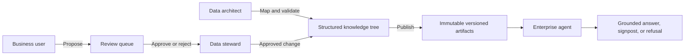

# Supply Chain Ontology, Process & Evidence (SCOPE)

> A governed knowledge control plane that lets people decide what enterprise agents know, calculate, and trust.

[](https://dotnet.microsoft.com/)


SCOPE organizes domain knowledge into an inspectable, tree-backed product. Business meaning, source mappings, calculation rules, evidence, freshness, ownership, and approvals live together instead of being fragmented across prompts, reports, code, documents, and individual experts.

This repository contains a sanitized public demonstration created for Microsoft Hackathon 2026.

## The Problem

Enterprise agents can produce fluent answers while relying on ambiguous terminology, stale data, unapproved calculations, business perceptions, or undocumented source mappings.

Business owners often cannot inspect what an agent knows, understand how it calculates an answer, or safely approve a change. This creates a trust and adoption gap between an AI prototype and an enterprise decision tool.

## The Solution

SCOPE provides reusable catalogs for:

| Knowledge area | What SCOPE governs |
| --- | --- |
| Ontology | Business objects, concepts, glossary terms, aliases, and relationships |
| Process | How demand, supply, buffers, and execution connect |
| Evidence | Source mappings, approved reports, grounding values, and provenance |
| Semantics | Measures, aggregations, filters, and calculation rules |
| Operations | Dataset freshness, status, ownership, and answerability |
| Governance | Proposals, duplicate checks, steward review, approval, and publication |

Only approved knowledge is released into immutable, versioned snapshots. An agent reads the published version rather than draft authoring content, so an unapproved edit cannot silently change what the agent interprets.

## Personas

- **Business users** browse approved knowledge, inspect traceability, and propose changes.
- **Data stewards** compare proposed and current content, review duplicate warnings, approve or reject changes, publish versions, and verify freshness.
- **Data architects** maintain source mappings, fields, and technical validation while preserving business ownership.

## What Makes It Different

Most AI solutions treat domain knowledge as prompt content or retrieved documents. SCOPE treats knowledge as an operated product with typed structure, ownership, lifecycle, validation, and a release boundary.

The model is reusable across domains: the application discovers a domain from its knowledge tree, so another supply-chain or business area can adopt the same catalogs and governance workflow without changing application code.

## Architecture



## Demo Flow

1. **Explore the ontology:** open **How Data Connects**, then inspect an object, concept, policy, glossary term, measure, and grounding value.
2. **Govern a change:** switch to **Business user**, propose an edit, then switch to **Data steward** to review the field-level difference and duplicate warning.
3. **Publish trusted knowledge:** approve the change and publish a new immutable version for downstream agent consumption.

## Run Locally

### Prerequisite

- [.NET 10 SDK](https://dotnet.microsoft.com/download/dotnet/10.0)

### Start SCOPE

From the repository root:

```powershell
cd hackathon/kb-app
dotnet restore
dotnet run --urls http://localhost:8080
```

Open <http://localhost:8080>.

## Repository Layout

```text
hackathon/
|-- kb-app/                 .NET API and browser application
|   |-- Program.cs          API routes and application composition
|   |-- Store.cs            Glossary authoring and publication
|   |-- Registry.cs         Governed measures and source registry
|   |-- TreeReader.cs       Structured catalog reader
|   |-- TreeStore.cs        Validated knowledge authoring
|   |-- ReviewStore.cs      Proposal and steward review workflow
|   |-- KbEval.cs           Duplicate evaluation
|   `-- wwwroot/            User interface
`-- knowledge-base/         Synthetic domain tree
	|-- _eval/              Governance checks
	`-- plan/               Demo supply-chain domain
```

## Technology

- .NET 10 minimal API
- SQLite authoring and review store
- YAML, JSON, and Markdown knowledge records
- HTML, CSS, and JavaScript browser interface
- Local-first, configuration-driven file paths

## Public Demo Notice

All knowledge, names, source mappings, grounding values, dates, and report links in this repository are synthetic examples. The public freshness adapter does not connect to a live enterprise data source.

This is a proof of concept. Role switching demonstrates the intended operating model; a production deployment must enforce authentication and authorization on the server.
